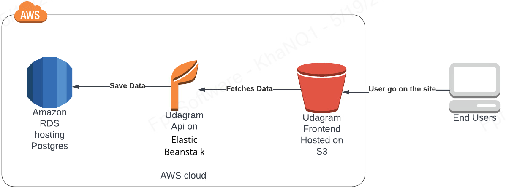

### udagram Infrastructure

### AWS
#### RDS postgres
The application uses aws RDS Postgres database
- database host: postgres.coutqyg1dzyu.us-east-1.rds.amazonaws.com
- database name: postgres
- database user: postgres
- database password: postgresPassword

#### EB
The application backend is deployed on AWS EB.
The application is built, archived, and uploaded to an S3 bucket, from where EB extracts and runs the application on an endpoint.
Eb URL: `http://udagram-api-dev22.us-east-1.elasticbeanstalk.com/`

#### S3
The frontend is uploaded to an S3 bucket, and that bucket is made publicly readable.
S3 bucket url: `http://myawsbucket-844723630086.s3-website-us-east-1.amazonaws.com`
