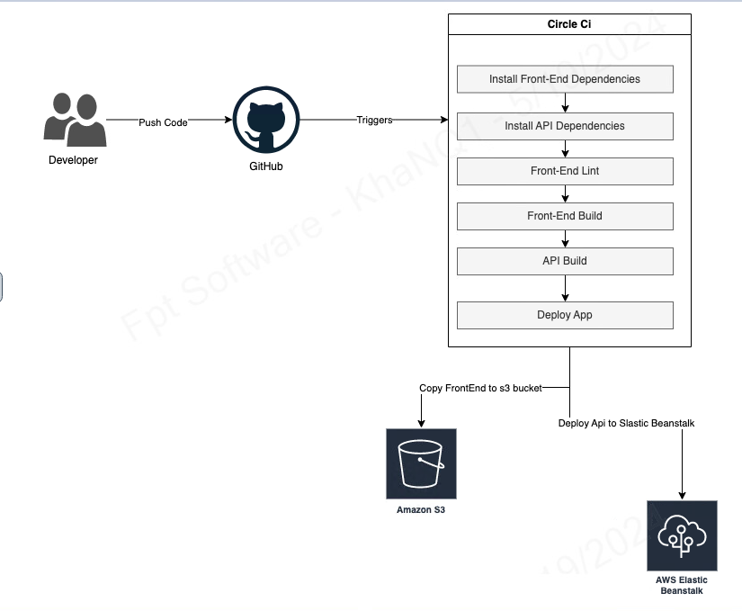

## udagram Pipeline
### CI
#### GitHub
- Create a new GitHub repo
#### CircleCI
Create a new project in CircleCI using your GitHub repo, and use the existing .circleci/config.yml file as a starter.
If your Github repo is connected to CircleCI correctly, then the commits/pushes to repo will trigger the CI/CD pipeline automatically.

Their are 2 jobs to run by CircleCI:
- **Backend api**: Runs the `build` script, exports all environment variables from CircleCI configuration to a `.env` file, then runs the `archive` script. 
Then uses EB to upload archive to S3.
- **Frontend**: Runs the `build` script given in the `package.json` file. Then uses AWS CLI to upload assets to S3.

